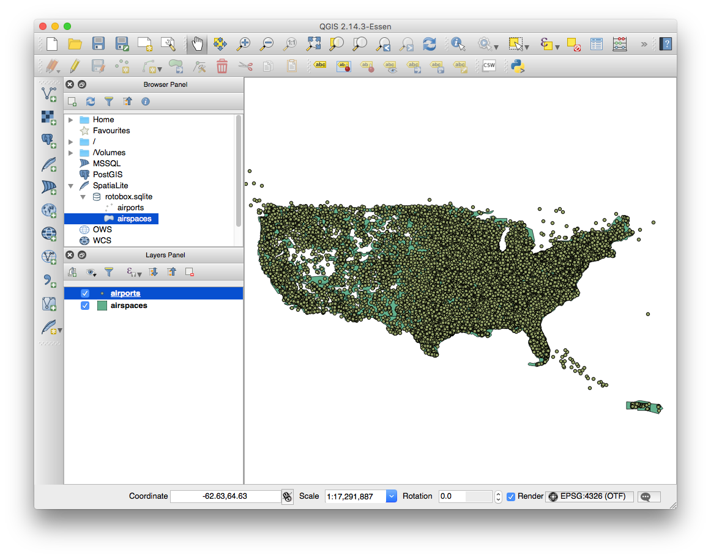

# rotobox
## Compiling on Ubuntu
Install dependencies via apt-get
````
sudo apt-get install build-essential libncurses-dev git cmake python-pip scons autoconf automake
````

## Compiling on OS X
Install dependencies via MacPorts
````
sudo port install cmake pkgconfig automake autoconf libtool
````

Build it!
````
make rotobox-deps
make
````

The following targets are available in the Makefile in case the dependencies take a poop when trying to build:
```
# Executes the clean target from the dependency's Makefile
make <DEPENDENCY_NAME>-clean

# Or, do a clean and then blow away the dependency's Makefile, forcing a reconfigure
make <DEPENDENCY_NAME>-reset
```

If you are running rotobox on a host other than where GPSD is running, provide the IP address to the GPSD host using the 'a' flag
````
./rotobox -a <IP_OF_GPSD_HOST>
````
Otherwise, if you want to fake out the GPS, you can use gpsfake along with the test GPS trace.  Update the paths below accordingly.
```
PYTHONPATH=~/src/rotobox/3rd_party_build/python/ GPSD_HOME=~/src/rotobox/3rd_party_build/sbin/ python ~/src/rotobox/3rd_party_build/bin/gpsfake -c 0.5 ~/src/rotobox/data/sample_tracklog.nmea
```

## SQLite Database
The SQLite database uses spatialite extensions for representing airspaces, airport locations, etc.  There are a set of tools under the scripts folder for creating/maintaining this DB.

````
./scripts/download_airports.py
````

You can also use [QGIS](http://www.qgis.org/en/site/) to view the contents of the resultant DB.  In the browser panel, select 'SpatiaLite', 'New Connection...' and then browse to 'rotobox.sqlite'

# 


## Charts
The leaflet map expects map tiles under 'wwwroot/charts' directory.  The following script downloads the necessary charts, crops them (only sectionals currently!) and then creates tiles.  
````
# Update the chart config to specify which charts you want
./charts/charts_config.json

# Run the update script
./scripts/download_airports.py
````

## Programming SDR serial numbers
```
3rd_party_build/bin/rtl_eeprom -d 0 -s 1090
```

## Calibrating SDR
Build/install http://www.fftw.org/fftw-3.3.5.tar.gz
https://github.com/steve-m/kalibrate-rtl

```
kal -s GSM850
kal -c 130
```
Where 130 is a strong channel shown by the first command.
